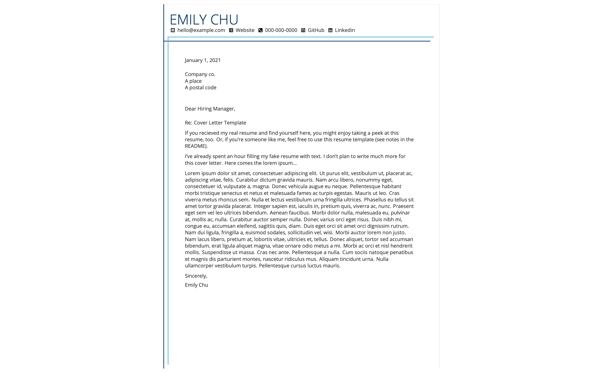
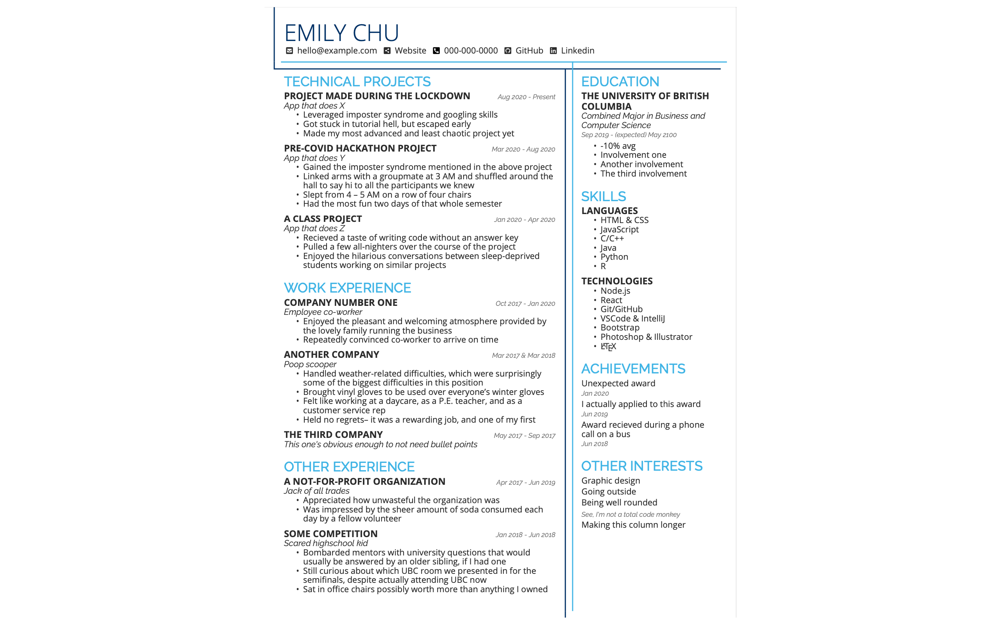

Made my own LaTeX resume template!
Inspired by the look of [Deedy Resume](https://github.com/deedydas/Deedy-Resume) and created using the [LaTeX Workshop](https://marketplace.visualstudio.com/items?itemName=James-Yu.latex-workshop) VSCode extension

### Why?
- All my past resumes were made in Word, and occasionally Canva, which both suck for consistent spacing/styles
- wanted to learn LaTeX in the hardest way possible (lol)
- investing time I won't have to spend during the semester
- in an attempt to make up for my lack of technical internships– "putting lipstick on a pig"

### Wow so pretty can I use it?
- Yes
- Feel free to contribute as well

You better star the repo though 😎

##### Take note: If you know who I am, you might be applying to the same jobs as I am. If you'd like to add a personal touch to this template, instructions are below.

### Editing:
- Contents of resume and cover letter are in their respective files
- Toggle compilation of resume/cover letter in MAIN.tex
- Colors (MainTheme, LightTheme, LeftTheme, and RightTheme) are defined in the class file
- Fonts + sizes are also defined in the class file. Raleway and Open Sans are used. Roboto is sitting there unsused in case another font is needed.
- Spacing can be tweaked in the class file by changing \tabcolsep and \arraystretch

### The TODO:
- Add links to projects section
- Certain spacings are still a quick fix, especially in the right column and the cover letter. However, it should be easy to spot and change these measurements for now.
- Magic number (\MagicVFill, approx. 700pt) must be changed if you change the height of the header. Otherwise, the vertical lines won't end the way I meant them to (but the template still looks OK when they're too long) Find a way to measure the header height dynamically, or fill remaining vertical space inside a minipage and tabular environment.